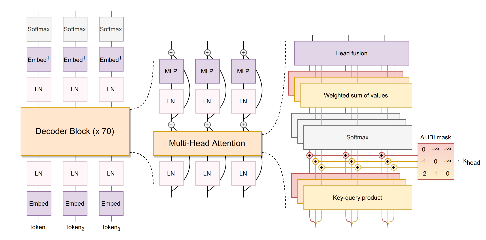

## GPT-Clone

---

### Overview

---
This project is an attempt to code up the following from scratch:

1. Attention mechanism
    
    a. Self-attention (&#9989;)

    b. Cross-attention (&#9989;)

    c. Narrow attention (&#9989;)

    d. Wide attention (&#9989;)
    
    d. Positional encoding (&#9083;, &#8987;)


2. Transformer architecture

    a. Transfomer v1 i.e., Encoder-Decoder (&#9989;)

    b. Transfomer v2 i.e., Decoder-only (&#9989;)


3. GPT family

   a. GPT-1 (full version &#9989;)
   
   b. GPT-2 (full version &#9989;)
   
   c. GPT-3 (reduced version &#9989;)

   d. GPT-3.5 (&#8987;)
   
   e. Chat-GPT (&#8987;)


4. BLOOM

   a. ALIBI mask (&#8987;)

   b. Architecture  (&#9989;)


| Property                 | GPT-1       | GPT-2       | GPT-3       |
|--------------------------|-------------|-------------|-------------|
| Number of parameters     | 117 Million | 1.5 Billion | 175 Billion |
| Number of decoder blocks | 12          | 48          | 96          |
| Embedding dimension      | 768         | 1600        | 12288       |
| Maximum token size       | 1024        | 2048        | 4096        |

### Repository Structure

---

The structure of the repo is as such:

```text
.
├── README.MD
├── main.py (⚠, ⌛)
├── assets
│   └── gpt-arch.png
├── data
│   └── io.py (⚠, ⌛)
├── main.py
└── scripts
    ├── architectures.py
    ├── attention.py
    ├── llms.py (formerly gpt.py)
    └── tests.py
```

### Architectural structures

---

***GPT-1***
&#9989;

---
***GPT-2***
&#9989;

---
***GPT-3***

Reduced version &#9989;

<a href="https://dugas.ch/artificial_curiosity/img/GPT_architecture/fullarch.png"></a>
<p align="center">Image Credit: <a href="https://dugas.ch/artificial_curiosity/GPT_architecture.html">Dugas' blog</a></p>

---

***GPT-3.5***
&#8987;

---
***ChatGPT***
&#8987;

---
***BLOOM***

Reduced version &#9989;

ALiBi mask &#8987;


<p align="center">BLOOM architectural design</p>

---
### Running tests

---

At present, tests can be run for the:
1. Attention (and MultiHeadAttention) implementation (`attention`)
2. Vanilla Encoder (`encoder`)
3. Vanilla Decoder (`decoder`)
4. Vanilla Encoder-Decoder (`encdec`)
5. Transformer (`transformer`)
6. GPT-1 (`gpt1`)
7. GPT-2 (`gpt2`)
8. GPT-3 (reduced version. See [Note](#note)) (`gpt3`)
9. BLOOM (reduced version) (`bloom`)

The tests can be run like so:

```bash
$ cd scripts
$ python tests.py
```

Next, you provide the name of the test to run. For instance, to run all tests, provide `all`. Select device to run test on as eitehr `cpu` or `cuda`. If the test runs successfully, you should get something like:

```text
Test `test name` succeeded!
```


### Legend

---

| Symbol   | Meaning                                |
|----------|----------------------------------------|
| &#9989;  | Implemented successfully               |
| &#10060; | Implemented; incomplete or failing     |
| &#9083;  | Placeholder in place; work in progress |
| &#9888;  | Excluded file; present in `.gitignore` |
| &#8987;  | Work in progress                       |

### Note:
1.  GPT-3 and BLOOM versions will be implemented at somewhere between a fifth to a tenth of their cannon size (subject to changes). For instance, GPT-3 has 96 stacked decoder blocks in practice. Here, it will be implemented with 9 decoder blocks.

